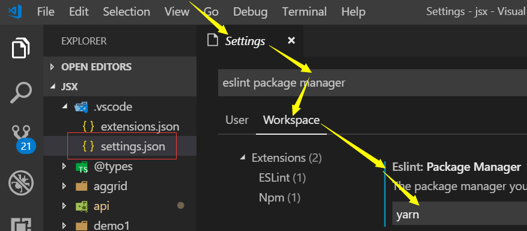

Change Eslint Package Manager from npm to yarn
=====

### Story

You may be troubled that when you create an Eslint configuration file in a VS code project, which uses yarn as project level package manager, eslint will call "npm install". While npm install shows some compaints "XXX package not installed by npm ...". This interchange using npm and yarn sometimes causes problems. You should set Eslint to use Yarn in this workspace/project.

### set Eslint to use Yarn
Use VS code UI settings editor, search "eslint package manager", change the option from default "npm" to "yarn". You may also choose the settings on "User" level or "Workspace" level.


```javascript
{

    "eslint.packageManager": "yarn"
}
```

### Picture


